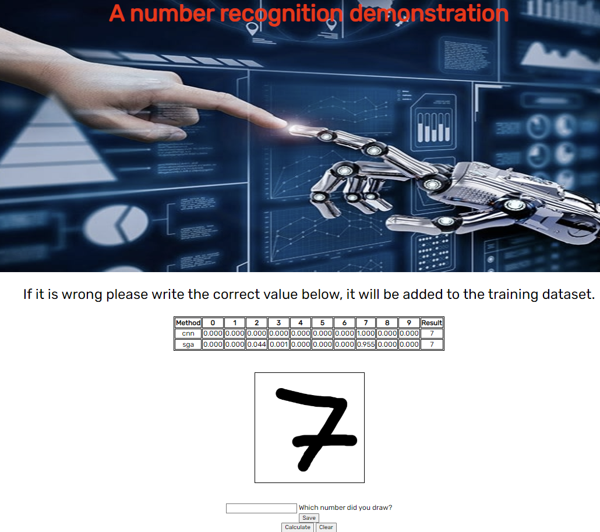

# Web Application For Number Recognition

Web application written in Python using `flask` and deployed on Heroku. The purpose of this project was to connect a UI with 2 of the ML models I have developed for recognizing handwritten numbers. 

# The MNIST dataset

The model was trained and tested using the MNIST dataset with some modifications.
The problem was that the MNIST dataset's images on grayscale contained pixel values between (0,255) which is a problem since the canvas you can draw on the site has a white background with a black pen, thus giving us an image that contains pixels values of 0 and 255. This led to our model making random assumptions on what number is given as an input.
A small fix that was applied to solve this problem was to tweak MNIST dataset's pixel values and forcing them to be either 0 or 255. 

# The models

Two models were used in the process:

* CNN: a simple CNN model with 2 dense layers (I will try making a more complex model in the future)
* Stohastic Gradient Ascent: a SGA model whose implementation will be added in a Notebook file

# The canvas 

As you open the site you will notice a 250x250 pixel canvas so you can freely draw the number which will then be cast in to a 28x28 image so it matches those dimensions of the MNIST dataset.

# Training the model

In the case that the prediction is wrong, user is prompted to write down which number was actually drawn onto the canvas. This image will be added to the training dataset and will be used in the future for further improvements. 

# Demonstration

